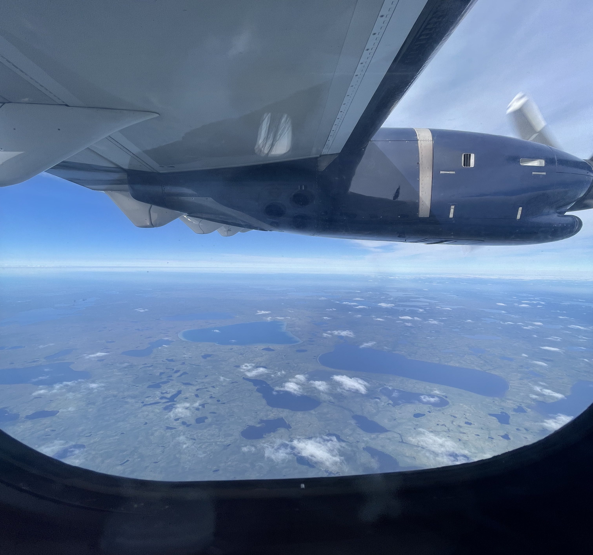
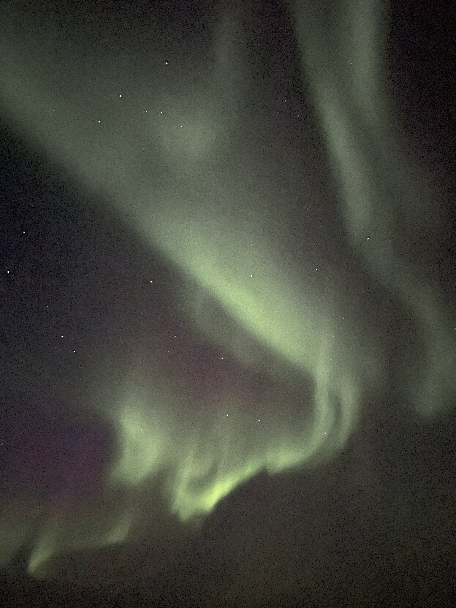

## I'm finally in the field!

I've been talking to Peter about doing research in Churchill since the summer of 2019, and two years later, here we are. In the span of a few short days, we went from designing back-up experiments to booking flights to Churchill (the requirements were: be double-vaccinated, have permission for off-campus fieldwork from Churchill, and have permission from the city of Churchill to land). Francine, a new Master's student in the lab, was also able to come and start research, so this is shaping up to be a productive, albeit late, field season!

Traveling from Toronto to Winnipeg to Gillam to Churchill took two days, and the further north I travelled, the more remote it became. I had previously done research in small towns, but the northern communities of Canada have a different kind of charm.

The [Churchill Northern Studies Centre](https://churchillscience.ca/) (CNSC) is top-tier. The staff are friendly, the rooms are comfortable, and there are lots of facilities (including a rec room and a gym!). I had been in contact with the CNSC for the last two years, so it was great to finally get up to here. We are putting in experiments in the next two weeks!

## The magical northern lights

The first thing I did when I woke up every day was check the weather, not because of rain or sun, but because I wanted clear skies to see the aurora borealis (which I've never seen before). The first four nights in Churchill were overcast with heavy clouds, and visibility was low because of smoke from forest fires further south.

On Friday, the forecast predicted clear blue skies all day, and no clouds at nighttime, but I still kept my fingers crossed all day (weather forecasts are notoriously unreliable in Churchill). There had been a lot of of solar activity, which meant that tonight was the night for northern lights.

And we saw them! 

The northern lights started dancing across the sky around 11 PM. The horizon was still light then, because we're up north so it doesn't get dark very fast, although the sunset was around 9:30 PM. We stood under the sky and watched the aurora borealis for a bit then, but we knew that the light show would only get more spectacular as it got darker.

Us researchers were all standing outside in the chilly 1 AM air, watching the lights curtain and billow and expand and dissipate. It really was magical, and don't do it justice. Really hoping for more cloudless nights because I don't think I will ever tire of watching the aurora!

## No bear sightings yet

But we are hopeful! Bear season has barely started, and Churchill is known as the polar bear capital for a reason.

Of course, I did have to get bear safety training. I received my PAL in 2019 (and have used it as an "interesting fact about me" for every icebreaker in the last two years). On our third day in Churchill, Peter took us to the Firearms Range where I showed off everything I remembered (which was not a lot), and also taught us how to be safe while doing research - by staying vigilant to prevent sneak bear surprises, and by scaring away bears if they do get close. I'll be happy if I never have to shoot a shotgun to scare away a bear.

We've driven up and down every road in Churchill and the surrounding area in the first week (for research, not just to track down polar bears!), but no bears have been spotted yet. We narrowly missed some though! On the day that we arrived, a bear was exploring the CNSC parking lot; and just yesterday, a bear was spotted in the tundra around the CNSC. 

## Overhead last week

Like I mentioned, Churchill has got some charm. Here are some things I overheard and should probably live by.

"_Churchill folks take trivia very seriously._"

"_Don't drive anywhere you don't want to back out of_."

And, the most important one: "_Be bear aware._"
