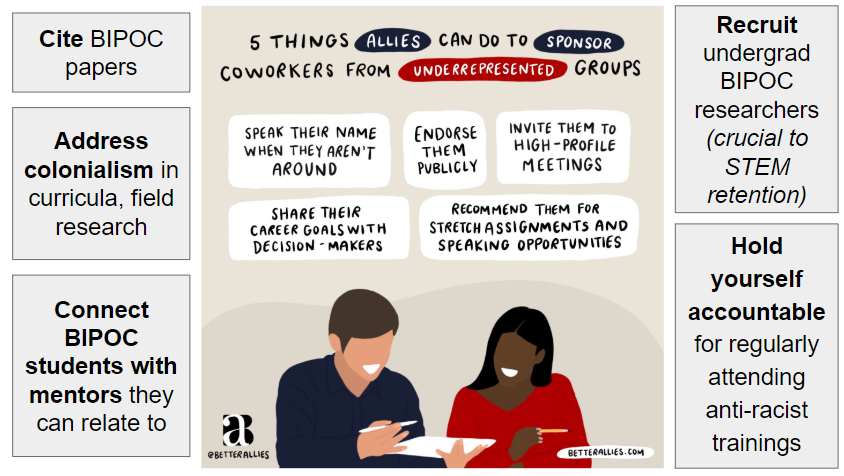

```{r include = FALSE}
knitr::opts_chunk$set(eval = FALSE, echo = FALSE, collapse = TRUE, comment = NA, tidy = FALSE)
```

This past Thursday, [Sophie B.](https://sophiebreitbart.wordpress.com/) and I co-led a lab meeting discussion about race and racism in academia with our labs ([Kotanen](https://www.utm.utoronto.ca/~w3pkota/), [Johnson](https://evoecolab.wordpress.com/) and [Wagner](http://sites.utm.utoronto.ca/wagnerlab/)). Prior to the discussion, we were nervous but excited; now, following the discussion, we are sharing all the resources that we have gathered in hopes that it might be useful to others who want to lead a discussion. Note: Sophie and I contributed in equal parts research, writing and presenting, and, after encouragement from our supervisors, sought help from [Equity & Diversity Office](https://www.utm.utoronto.ca/equity-diversity/home) at UTM. NNone of the actual open discussion will be posted publicly without consent from the lab. _**Comments in bolded italics are side notes**_

## Introduction

We have three main goals for the meeting, and alongside these goals, we have several agenda items.

1. Begin a conversation about race
    - introduce meeting and explain why we wanted to host this discussion
2. Reflect on our individual relationships with race in and out of academia
    - individual activity
    - present examples of how racism has infiltrated and shaped academia
3. Discuss how we can address racism as academic scientists
    - discuss examples of racism that we have seen
    - discuss and commit to action items

Before we dive in, we have a disclaimer:

- **We, the discussion co-leaders, are not leading authority figures on diversity and race.**

    Diversity, race, and social issues are not our area of research. Although we didn't feel qualified to lead this discussion at first, we felt even more strongly that the discussion had to start.

- **Our perspective is narrow.**

    Our three labs are are not racially diverse, and we are largely focusing on race in the context of science. 

- **We are nervous too.**

    We acknowledge that race is a hard topic to think and talk about.

- **We encourage you to do further research, attend equity, diversity and inclusion workshops and formal training, and seek professional advice to discuss traumatic events.**

    We are not professionals, we still have a lot to still learn.

## 1. Begin a conversation about race.

Sophie and I decided to host this multi-lab meeting and discussion on race for several reasons. In May and June, the race-related tragedies and subsequent media coverage in the US and Canada were widely accessible, and we not only felt really upset, but also believed that it was the opportune time to do something. We thought that it would be worthwhile to spend an hour with our labs discussing race and racism. Throughout out research, we learned that being actively anti-racist is a lifelong task that involves, at the very least, talking about how race intersects with different aspects of our lives. Since race largely shapes academic life, we felt that an important first step is to start talking about it within our labs. [Discussing race in higher education is important.](https://www.youtube.com/watch?v=ldaBwZc6mPA)

A lot of people believe that politics and science should not mix, and that some topics do not belong in scientific articles, journals or even on scientific Twitter. However, we are in the business of collecting data, and here *the data doesn't lie*. BIPOC people have been oppressed for centuries, have constantly been the victims of racism and police brutality, and are still being targeted in many, if not all, facets of society, including academia. A quote from a Scientific American article, "[Silence Is Never Neutral; Neither Is Science](https://blogs.scientificamerican.com/voices/silence-is-never-neutral-neither-is-science/)", drives home this point:

> "The pervasive silence on racism across science institutions is self-reinforcing; it creates a culture where talking about racism is actively discouraged and where Black, Latinx and Indigenous scientists cannot bring their whole selves to their work. It also means science may not even be asking the right questions in the first place.”

We fear that we will say something offensive or incorrect, but if we do not try to talk about race, we **cannot** talk about race, and that will further perpetuate racism.

## 2. Reflect on our individual relationships with race in and out of academia

There were two sections to this goal: an individual activity and a presentation on anti-Black racism in academia. Before we begin, we want to present a quote by Shelly Tochluk from a "[Witnessing Whiteness](https://witnessingwhiteness.files.wordpress.com/2014/06/ch5_positions_priv.pdf)" workshop series that helped us get into a mental space appropriate for the activity:

> “When we enter multiracial spaces, we often take with us our own discomfort with our racial selves. Especially for those of us who have only recently begun to recognize the ways that the more subtle forms of racism emerge, our earlier lack of sensitivity can turn into an awkward oversensitivity. Where once we never noticed race (or at least claimed not to), increased awareness makes issues of race appear ever-present. Race consciousness is at its height and we can often feel paralyzed while trying to figure out how to behave in order to subvert the racism in the room while not appearing racist by concentrating on race in the room! “What will the person of color think? What if I say the wrong thing?” Our deep sense of guilt over our history and our current ineptness damages our ability to relate.”

### An individual activity on privilege

This activity, titled "Multiple Modes of Privilege", was adapted from chapter 5, workshop 5, of "Witnessing Whiteness". It was meant to explore various specific ways that we might receive privilege or be oppressed based on our multiple identities.

_**We asked lab members to grab a piece of paper and a pen; the paper was divided so that the left column said "TARGET" and the right column  said "NON-TARGET". Sophie and I alternated reading a series of 10 statements describing situations, and participants identified whether they are a target by making a mark in the appropriate column.**_

**Situational statements**

1. If you believe you have been followed around a store while you shopped because of your race, put a mark on the target side. If this has not been your experience, put a mark on the non-target side.

2. If you learned to speak English as a first language, put a mark on the non-target side. If your first language was another language, put a mark on the target side.

3. If, as a child, you had a room of your own with a door, put a mark on the non-target side. If you had to share a bedroom or sleep in a room that doubled as another room, put a mark on the target side.

4. If you were raised to believe people will assume your behavior is a reflection of your race as a whole, put a mark on the target side. If you were not raised to believe this, put a mark on the non-target side.

5. If people question you whether you’re a man or a woman, put a mark on the target side. If you are never questioned about this, put a mark on the non-target side.

6. If your elected or appointed officials are comprised primarily of people of your race, put a mark on the non-target side. If this is not the case, put a mark on the target side.

7. If you worry about racial profiling by the police because of your race, put a mark on the target side. If you do not worry about this, put a mark on the non-target side.

8. If the religious or cultural holidays your family celebrates are normally recognized as official holidays by most schools and employers indicated by either a day off or increased pay for working those days, put a mark on the non-target side. If these holidays are not normally recognized as holidays by most of these institutions, put a mark on the target side.

9. If you do not have to consider if a workplace, restaurant, bank, or friend’s home is physically accessible to you, put a mark on the non-target side. If you do have to consider this, place a mark on the target side.

10. If the books you read in school largely featured people of your race, put a mark on the non-target side. If the books you read did not largely feature people of your race, put a mark on the target side.

**Reflection**

_**After all statements are read, we debriefed.**_

Notice the number of marks on each side of your paper. The "TARGET" side represents experiences of oppression, and the "NON-TARGET" side represents experiences of privilege. Although we weighted this list of statements to focus more on race, we still tried to acknowledge other social identities, whether visible or not. We need to always recognize that we are complex people with many different aspects to our life experience. In addition to this, we need to spend time paying attention to privilege that is a result of race because it is frequently swept under the rug.

Consider whether your individual responses were consistent with patterns associated with the typical experience of the various social positions that you represent. We asked that you do not share, as your individual experiences may be best directed under someone who is more equipped to explore these feelings. Instead, we will give everyone one minute to silently reflect, using following questions as a guide.


It's easy to concentrate on areas where we identify as being targets, but a challenge is that a lot of emotion often comes up when we speak about privilege. It is difficult to take responsibility for dismantling privilege in areas where we are part of the dominant group, largely due to the resistance or guilt that arises. In fact, a common issue is that a deep sense of guilt can inadvertently make us less effective allies for those who are targets. This activity was not meant to make people feel bad about their background, but instead to inspire ways to use our privilege to interrupt systemic racism, and to enact real change in several areas of our lives, including academia.

**We all have different axes of disadvantage.**

### A brief history of anti-Black racism in academia

_**After the activity, we presented some ways of how race and science are intertwined.**_

The aim in this next section to demonstrate that science is implicit in racial tendencies. There seems to be collective amnesia especially surrounding the role that science played in legitimizing and justifying racism and other atrocities, and how differences among people were evolving into scientific theories about racial hierarchies. By understanding and reckoning with the legacy of past science, we hope that this makes us better scientists and better humans in our diversifying fields. By no means is this an extensive history, and we really encourage digging deeper in the history, both scientific and otherwise, especially on topics like the American Civil War, the Civil Rights Movement, and scientific racism. You might also consider how pseudoscience and scientific racism of the past have affect internal biases and help entrench racism into our social systems, and the impact of work in your field.

#### Scientific Racism

**Phrenology** was a hit during the first half of the 19th century. [Franz Joseph Gall](http://www.historyofphrenology.org.uk/fjgall.html) first began studying and lecturing “mental faculties” of the brain (organology), and how to read the shape of the skull (cranioscopy); his collaborator [Johann Gaspar Spurzheim](http://www.historyofphrenology.org.uk/spurzheim.html) then popularized the term “phrenology” to define the science of determining an individual’s traits, character, talents and social status using the size and shape of the head.

Phrenology resulted in many atrocities committed. For example, Native American burial sites, tombs, corpses were scavenged to collect skulls from every continent. Phrenologists then created and compared head casts and stolen skulls. All African Americans were generalized as inferior, uncivilized and “less beautiful”, all due to smaller head sizes and cerebral masses. In comparison, "superior" slaves demonstrated non-threatening traits such as morality, “domestication” and intelligence, which were linked to their larger skulls. Phrenology has lead to contributions in neuroscience, especially the concept of cortical localization (mental functions localized to specific areas of the brain). A very detailed history on phrenology can be found [here](https://muse.jhu.edu/article/647919).

**Eugenics** was coined in 1883 by [Francis Galton](https://en.wikipedia.org/wiki/Francis_Galton) (a half-cousin to Darwin), and he went on to champion the emerging scientific field, leading to papers on [nature versus nurture](http://galton.org/essays/1870-1879/galton-1874-men-of-science.pdf) and to the political [eugenics movement](https://www.nature.com/scitable/topicpage/human-testing-the-eugenics-movement-and-irbs-724/). Eugenics is the idea that a person’s genes determine all traits, from height, to intelligence to disability, and that some trait variants are better than others. This is genetic determinism that has been used to justify [slavery](https://news.virginia.edu/content/uva-and-history-race-eugenics-racial-integrity-act-health-disparities), [selective breeding](http://www.eugenicsarchive.org/eugenics/image_header.pl?id=248&printable=1&detailed=0), [sterilization](http://www.eugenicsarchive.org/html/eugenics/essay8text.html), and dangerous social policies (e.g., Nazi eugenics and the Holocaust during WWII).

Eugenics was widely accepted in the past, and vestiges of eugenics is still felt today. Eugenics studies were published in a prestigious [journal](https://www.theguardian.com/science/the-lay-scientist/2011/feb/23/2) that is now better known as the *Annals of Human Genetics*, and eugenics was taught in universities. Obviously there has been a shift away from eugenics and race science, but this pseudoscience was studied, taught, and researched for decades, and we are not that separated in terms of academic generations.

**Social Darwinism** can be loosely defined as misapplying Darwin’s theories on evolution by natural selection in a way to [justify genocide and racism](https://www.jstor.org/stable/pdf/2967206.pdf?refreqid=excelsior%3Ae51b10f0bddac6ab85992a61f5d98d47). For example, the [powerful figures in society are innately superior](https://www.amnh.org/exhibitions/darwin/evolution-today/social-darwinism), and this is proven by their social status and power. A leader of social Darwinism was Herbert Spencer, who coined the term “survival of the fittest” during the Industrial Revolution. Under social Darwinism, class stratification and inequalities abounded, where the poor, “unfit”, and “lesser breeds” were exploited. Proponents reasoned that superior groups (such as white Europeans) can use slavery to refine cultures and advance the evolution of society, asserting Black inferiority, white superiority, and supporting racist social policies. Today, the vestiges of social Darwinism abound when the rich are considered the best/smartest/most qualified. This is felt in the racial distribution of wealth, the quality of healthcare between rich and poor, and the backing of removing welfare and government support programs. And, when examining the richest, most powerful folks of the Western world today, they are largely white.

#### Individuals

Next, we wanted to profiles some scientists were emblematic of the racist scientific atmosphere, and this further illustrates that science has always had racist roots. The repercussions of their work have lasted and been very problematic.

**Charles Darwin** is known to have hated slavery, but it also appears that Darwin held some racist views. Through Darwin’s writings we can see that he believed evolution was progressive, and that white races (especially Europeans) were [more advanced than black races](https://www.independent.co.uk/arts-entertainment/books/features/did-charles-darwin-believe-in-racial-inequality-1519874.html). From *The Descent of Man*, he noted that "the civilised races of man will almost certainly exterminate, and replace, the savage races throughout the world." And at its core, these beliefs establish race differences and yield a racial hierarchy.

**Carl Linnaeus** laid the foundation for our current taxonomic system. However, in addition to that, [Linnaeus](http://www.leeds.ac.uk/educol/documents/157423.htm) was also "a pioneer in defining the concept of race as applied to humans. In *Homo Sapiens*, he proposed four taxa or categories based on place of origin at first, and later skin color. Each race was ascribed with characteristics that were endemic to individuals belonging to it."

"Over time, this classification was used by many European countries to validate their conquering or subjugation of members of the "lower" races. In particular the invented concept of race was used to enforce slavery, particularly in the new world European colonies, and also as a basis for ethnic cleansing in 1930s Europe.”

_**Quotes are directly from "Out of the Shadow of Linnaeus: acknowledging their existence and seeking to challenge, racist practices in Swedish educational settings," by Camilla Hällgren and Gaby Weiner. This paper was presented at the European Conference on Educational Research, University of Geneva, 13-15 September 2006.**_


**Ronald A. Fisher** has made [significant impacts in science and math](https://makingscience.royalsociety.org/s/rs/people/fst00034451) that cannot be understated. He is known as one of the three principal founders of population genetics and the father of modern statistics and experimental design. He was also a believer in eugenics and used [statistics to back it up](https://njoselson.github.io/Fisher-Pearson/). In his book *The Genetical Theory of Natural Selection*, apart from devoting three chapters to defend colonialism, white supremacy and eugenics, Fisher also wrote that "civilizations fail because people of 'low genetic value' (read black and brown people) have more children than people with “high genetic value” (read white Europeans) and said that this was already happening in Great Britain". He also advocated that inferior races, if allowed to immigrate to England, should be restricted in the number of children they have.

**James Watson** is another huge figure in biology because of his role in the discovery of DNA. He has made several comments about the link between race and intelligence, specifically about how Africans are less intelligent than other races, which white supremacists have used to further their agendas. He refuses to apologize for his statements and has [lost all his titles and honors](https://www.theguardian.com/world/2019/jan/13/james-watson-scientist-honors-stripped-reprehensible-race-comments) from the Cold Spring Harbor Laboratory, a very prestigious lab that he led for many years. 

These scientists were not alone in their ideas, and they represent a long history of racism in science. Telling your students about the more problematic side of major historical figures is one way to acknowledge racism in your own classes. Being honest about the ugliness of scientific history is a powerful way to acknowledge that racism has existed for a long time, and that artefacts of scientific racism are still around today.

How do you begin to acknowledge and tell these facts? Here's an excellent example from [Gigi Hoi](https://mideo.eeb.utoronto.ca/people/amber-gigi-hoi/) from a [BREWS](http://brews.eeb.utoronto.ca/) talk:


It's important to be specific and tell it as it is. Historically, EEB is rooted in colonialism and racism, and this fact should not be glossed over.


#### Environmental Racism

Clearly, morality, ethics, social awareness has all evolved over time. However, saying that something is a thing of a past is not an excuse. The movement today should be a time to reflect.

What about science today? Think about how a social construct like race has seeped into your life and how it might affect the science you do. I’m just going to highlight one instance, environmental racism, that I think is really relevant to us ecologists, and also as people living through a climate crisis.

There is a lot of evidence that shows that climate disasters [disproportionately](https://www.theguardian.com/environment/series/our-unequal-earth) impact [POC communities](https://www.npr.org/2019/09/03/754044732/as-rising-heat-bakes-u-s-cities-the-poor-often-feel-it-most), whose residents breathe in more pollution, live in hotter conditions, and are relegated to unwanted neighbourhoods with less greenery. There was [redlining](https://www.npr.org/2020/01/14/795961381/racist-housing-practices-from-the-1930s-linked-to-hotter-neighborhoods-today) (ca 1938-1968), the ranking of neighbourhoods to deny financial services and health care by the FHA to undesirable and risky neighbourhoods that were predominantly neighbourhoods of POC. This is no longer in practice, but the effects of it are still felt today, seen in the racial segregation of cities, the racial wealth gap, and public health. However, those communities and people who are most profoundly affected are rarely part of the environmental conversation - research and academia continues to be [driven by white males](https://www.nsf.gov/statistics/2017/nsf17310/digest/occupation/overall.cfm). Environmental racism is the term to describe injustices arising at the intersection of environmentalism, social justice, and socio-economic factors.

## 3. Discuss how we can address racism as academic scientists

### Rules

_**The idea to enforce discussion rules came from [Bryan Gee](https://bryangee.weebly.com/) and [Denny Maranga](https://twitter.com/dicedinos), who co-led a graduate student discussion on race several weeks prior to our discussion. They had their rules written in the Waiting Room of the Zoom meeting, and participants were given about a minute to read the rules. We stole their ingenious idea for our own lab meeting, and reiterated the rules again prior to the discussion portion of the meeting.**_

Before we start, we want to revisit some discussion rules (adapted from the [Center for Research on Learning and Teaching, University of Michigan](http://crlt.umich.edu/publinks/generalguidelines)). We ask that you come with an open, non-judgmental mind and do not seek to be either combative or accusatory. Everyone is coming from different backgrounds, and this is a space to come together to collaborate, so we ask that you please respect the space and be mindful of how you interact with it.

1. Criticize ideas, not individuals.
2. Commit to learning, not debating. Comment in order to share information, not to persuade.
3. Avoid blame, speculation, and inflammatory language.
4. Allow everyone the chance to speak. Balance your speaking and listening time. We want everyone to be a part of this conversation and to feel that their voice is valued, because it is.
5. Avoid assumptions about any member or generalizations about social groups. Do not ask individuals to speak for their (perceived) social group.

### Discussion Prompts

We are undergrads, grad students, TAs, postdocs, professors, principal investigators. We are all members of academia with different roles, and with those roles come different rights, responsibilities, levels of privilege, and access to decision-making. Think about your own role, and the changes that you can implement in order to change your own practices as well as the academic system. We recognize that many actions might function on a lab-by-lab basis, but also many actions function at larger levels such as at the departmental or institutional level. Obviously, this meeting is not the best place to think of a lab-specific plan, but this discussion might help fuel future lab-specific discussions.
Emphasize we personally, and “smaller” actions are still actions that can change the system.

Questions we explored during the discussion: 

- **What are some examples of racism you’ve seen in academia?** Can you name any specific situations as it relates to any of these categories, or categories not mentioned here? This discussion is meant to call out typical academic practices and events that uphold systemic racism, not specific people. This should not be targeted. _**Not a comprehensive list.**_
    - Application process / recruitment / hiring practices
    - Classes (as a student, TA, professor)
    - Research (recruitment, lab work, field work, etc.)
    - Mentoring (mentor/mentee availability)
    - Publishing
    - Conferences
    - Retention
    - Social situations & networking
    - “[Hidden curriculum](https://www.edglossary.org/hidden-curriculum/)” (unspoken or implicit academic, social, and cultural messages communicated to students while in school.)
- **How can we change these situations?**
    - Undergraduate → Grad school → Postdoc, faculty, staff positions
- **How can we change our own practices and academic system to address anti-Black Racism?**
    - Below are just a few examples of ideas, but it is not exhaustive.



## Parting Words

1. **Do more research**

    There are topics that we didn’t discuss but are still important within the conversation of race. We have some [resources](https://docs.google.com/document/d/1AtfDivUjMDsf_6KxBBvZgG44ruzusYPuVw2D-FRSWIU/edit?usp=sharing) that provide more info, and we recommend seeking more resources! There is no simple answer or solution and remember that learning is lifelong; normalize making mistakes but also taking ownership of mistakes, and strive to change for the better!

    - White Silence
    - White Fragility and White Supremacy
    - Racial Colourblindness
    - Police Brutality, Blue Lives Matter, the Blue Code
    - Race and Health (e.g., COVID-19)
    - Allyship
    - Under-represented minorities (URM) in the academic pipeline
2. **Take it one article at a time**

    Learning about racism can be overwhelming. Again, this is a lifelong task.

3. **Commit to 3 actions you will undertake as an ally.**

    Write them down and hold yourself accountable.

4. **Use what privilege you have to enact change and be a role model.**

    If you have privilege, use it to enact change and be a role model. Just like how some men do not want to listen to women speak about their experiences with misogyny, many people don’t want to listen to BIPOC people speak about their experiences. So as a white person, use your privilege to get people to listen to you about these issues.

_**Thank lab members for participating, for being respectful and thoughtful, and for contributing. We solicited feedback via an anonymous survey (what was good, what didn’t work, etc.) for other lab-based discussion and future work. Finally, we included a list of UofT and UTM offices that provide resources, support, counseling and assistance.**_
